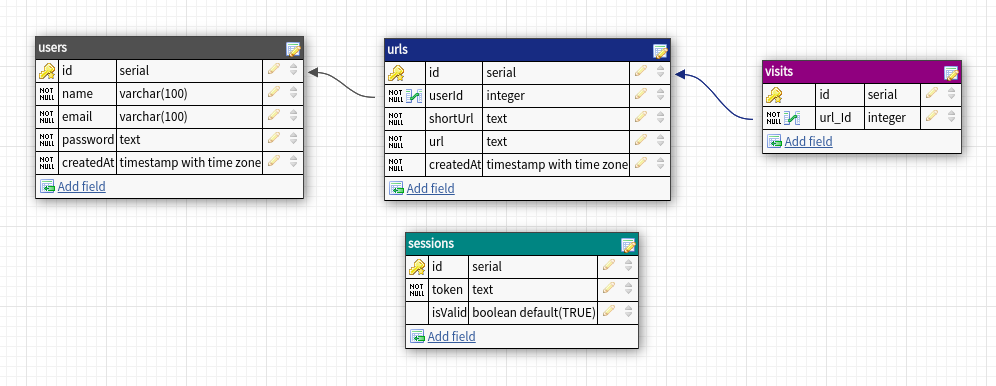

# :shorts: Shortly :shorts:  

A restful api that makes it easier to you shorten your urls!

 

   

## About

This api helps you to manage your shorten urls and share with your friends! Below are the implemented features:

- Sign In
- Sign Up
- Create a url shorten of a link
- Delete a url shorten
- Manage your shortened urls
- See how mutch your shorten url was visited
- See a ranking of all people url and how mutch was visited
